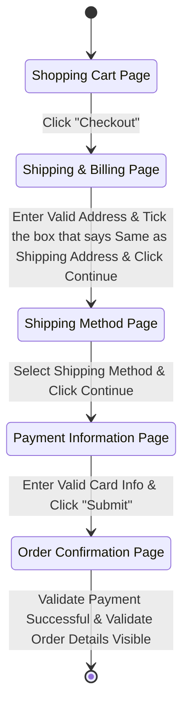

# Mermaid State Machine Generation Skill

Analyzes existing Flow Model documentation (ASCII flow diagrams describing a user journey,
such as `docs/FLOW-MODELS-DESIGN-EXAMPLE.md`, a generated `docs/FLOW-MODELS-DESIGN.md`, or any
similarly-structured flow design doc) and generates or updates a `docs/STATE-MACHINES.md` file
containing the same journey(s) expressed as [mermaid.ai](https://mermaid.js.org) state
diagrams.

This skill is **documentation-to-documentation**: it does not read test files and does not
generate or modify Flow Model / Page Model code (`business/flows/*.flow.ts`,
`business/pages/*.page.ts`). For that, use the `flow-model-generation` skill instead. This
skill's only job is turning an existing Flow Model design doc into an equivalent Mermaid
state diagram.

## Example mermaid.ai output



## What It Does

1. **Analyzes Flow Model Documentation** — Reads the target flow design doc(s) (ASCII flow
   diagrams, sub-flow diagrams, delegation notes, page/flow model summaries)
2. **Identifies States & Transitions** — Maps each page/step in the ASCII diagram to a
   Mermaid state, and each user action (or sequence of actions) between two pages to a
   transition
3. **Identifies Sub-Flows** — Maps any "DELEGATE TO ..." / "Sub-Flow" sections to nested
   (composite) states or to a separate diagram, preserving the reuse relationship
4. **Generates/Updates STATE-MACHINES.md** — Writes one mermaid `stateDiagram-v2` block per
   top-level flow (plus one per meaningfully distinct sub-flow) into the target folder's
   `docs/STATE-MACHINES.md`

## Process

### Step 1: Analyze the Flow Model Design Doc
- Read the target design doc (e.g. `docs/FLOW-MODELS-DESIGN-EXAMPLE.md`,
  `docs/FLOW-MODELS-DESIGN.md`, or a project-specific equivalent)
- For each `## Flow N: ...` section, walk the ASCII box-and-arrow diagram top to bottom
- Note any `╔══ DELEGATE TO ... ══╗` blocks — these become either a transition into a nested
  composite state, or a link to that sub-flow's own diagram
- Note any branch points (`├─ YES` / `├─ NO`, decision diamonds described in prose) — these
  become Mermaid choice/fork transitions
- Note the page/flow model summary sections at the bottom of the doc — they confirm the
  canonical page names to use as state display names

### Step 2: Map Flow Steps to States and Transitions
- **One state per page/major step** the user lands on (not one state per individual click) —
  e.g. an "Enter Address" + "Verify no errors" + "Click Continue" sequence of boxes that all
  happen on the same page collapses into a single state, with the sequence of actions becoming
  the label of the transition *out* of that state
- **State IDs** must be short, PascalCase, and contain no spaces or punctuation (Mermaid
  identifier rules) — e.g. `ShippingAddressPage`, `OrderConfirmation`
- **Display names** are set separately via the `StateId: Human Readable Name` alias syntax, so
  the diagram can show the full page name from the design doc without breaking the ID
- **Transition labels** combine the action(s) that cause the move to the next state, joined
  with `&` if there are several (matching the "Example mermaid.ai output" style above);
  quote UI text exactly as it appears in the source doc (e.g. `Click "Checkout"`)
- **Start and end**: the first state in a flow transitions from `[*]`; the last state
  transitions to `[*]`
- **Reused pages** (the same Page Model appearing at two different points in the journey, as
  called out in a design doc's notes) get **one state definition**, referenced from both
  places in the diagram rather than duplicated under two different IDs
- **Sub-flows / delegation**: represent as either
  - a **composite/nested state** (`state X { [*] --> ... }`) when the sub-flow is short and
    conceptually "inside" one step of the parent flow, or
  - a **separate `stateDiagram-v2` block** with its own heading, cross-referenced by name from
    the parent diagram, when the sub-flow is substantial or reused by multiple parent flows
- **Branches / alternate paths**: use a Mermaid choice state (`state choice <<choice>>`) or a
  labeled fork when the source doc shows a decision point (e.g. "same as shipping?", "auth
  valid Y/N"); if the source doc only *mentions* a future/alternate path without fully
  diagramming it, still add it to the state machine as a lightly-noted transition so the
  diagram doesn't silently drop information the design doc contains

### Step 3: Write/Update STATE-MACHINES.md
- Target location: the **same `docs/` folder** as the source design doc being analyzed
- File name: `STATE-MACHINES.md`
- Structure:
  - A short intro line naming the source design doc(s) the diagrams were derived from
  - One `## <Flow Name>` heading + fenced ```mermaid stateDiagram-v2``` block per top-level
    flow from the source doc, in the same order they appear there
  - One heading + block per sub-flow worth diagramming on its own (per Step 2's composite vs.
    separate-diagram judgment call)
  - A one-line note under each diagram naming which source `## Flow N` section and which Flow
    Model method(s)/orchestration it corresponds to, so the two docs stay traceable to each
    other
- If `STATE-MACHINES.md` already exists, update only the diagram(s) affected by the change in
  the source doc — leave unrelated diagrams untouched, the same way `FLOW-MODELS-DESIGN.md` is
  updated incrementally by `flow-model-generation`
- **Do not** generate, modify, or reference concrete `.flow.ts` / `.page.ts` files — this
  skill produces diagrams only

## Usage

Ask Claude Code directly, pointing at a Flow Model design doc:

```
Generate a mermaid state machine from docs/FLOW-MODELS-DESIGN-EXAMPLE.md
```

Or targeting a specific flow within a larger doc:

```
Generate a state machine diagram for Flow 3 (Pre-Authenticated Salesforce Access) in docs/FLOW-MODELS-DESIGN-EXAMPLE.md
```

Or for a project-specific design doc under a different name:

```
Generate a mermaid state machine from sticky-minds-article/docs/WEB-SHOP-FLOW-MODELS.md
```

## Output

The skill will:
1. Display which flow(s)/sub-flow(s) were found in the source design doc
2. Show the generated Mermaid state diagram(s)
3. Report whether `docs/STATE-MACHINES.md` was created or updated, and which sections changed
