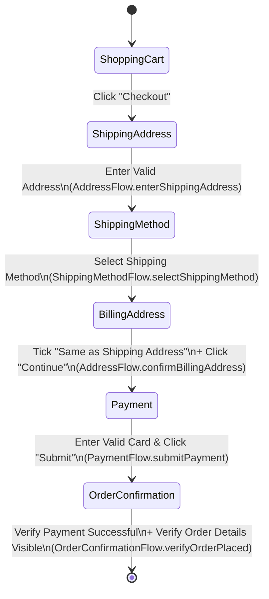
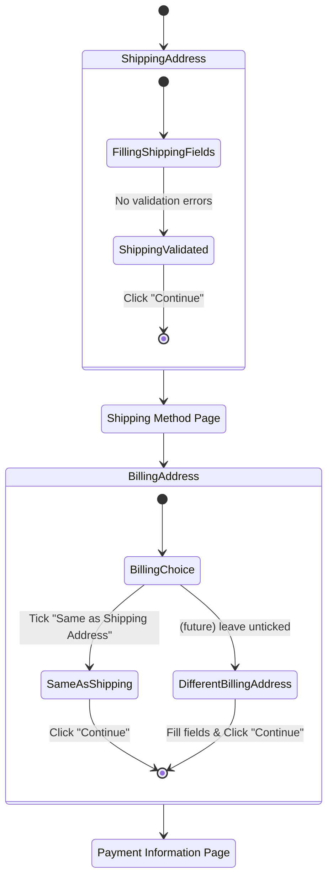
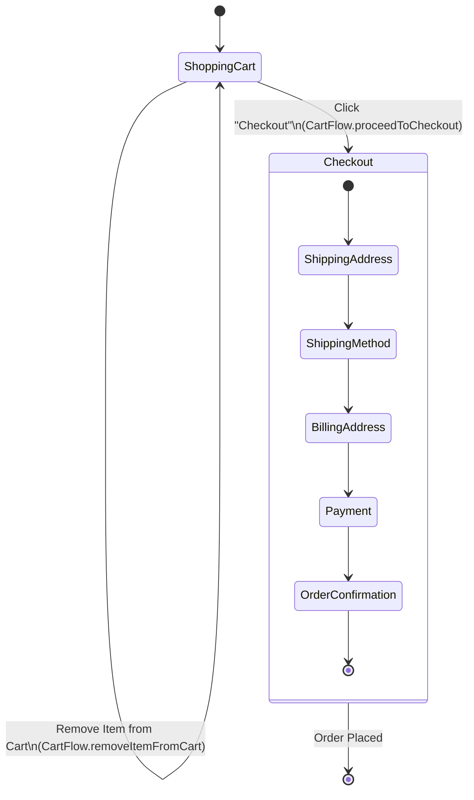

# State Machines - Web Shop Example

Mermaid state diagrams derived from the flow diagrams in `docs/WEB-SHOP-FLOW-MODELS.md`.
Each state below corresponds to a step/page in that document; each transition corresponds to
a user action or Flow Model method call from the same document.

## Checkout Flow - Happy Path

Corresponds to "Flow 1: Checkout Flow - Happy Path" in `WEB-SHOP-FLOW-MODELS.md`, orchestrated
by `CheckoutFlow.completeCheckoutHappyPath()`.

## Address Flow (shared Shipping & Billing Page)

Corresponds to "Sub-Flow: Address Flow" in `WEB-SHOP-FLOW-MODELS.md`. `ShippingAddress` and
`BillingAddress` are two different call sites of the same `ShippingBillingPage` Page Model,
reached via two different `AddressFlow` methods. The dashed transition shows the currently
undiagrammed alternate path noted in the design doc.

## Order-Level Lifecycle (including out-of-scope Cart Management)

A wider view combining the happy-path checkout with the cart-management actions called out as
"Out of Scope for the Happy Path Diagram" in `WEB-SHOP-FLOW-MODELS.md`. Cart edits are
self-transitions on the `ShoppingCart` state and occur before `CheckoutFlow` begins.

